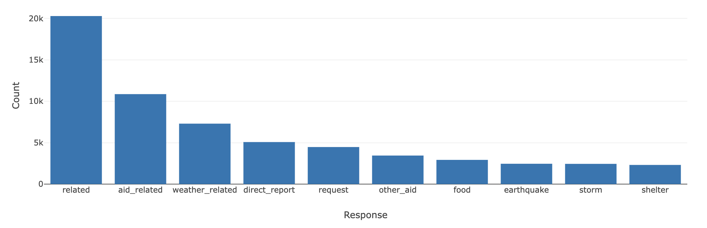

# Disaster Response Pipeline Project

## Introduction
<p align="center">
  
  
</p>
This project is designed to assist people during disaster events by providing a ML-based approach to categorize and prioritize emergency messages. The application processes and classifies incoming messages into 36 predefined categories, helping emergency responders quickly identify the most critical needs.

The project includes the following key components:

1. **ETL Pipeline**: Extract, Transform, Load (ETL) pipeline to process and clean data.
2. **Machine Learning Pipeline**: A model that classifies messages into 36 categories, helping responders allocate resources.
3. **Web Application**: A Flask-based web app that allows users to input messages and receive real-time category predictions, along with visualizations of disaster data.
## Project Structure
```
- app/
    - templates
        - go.html
        - master.html
    - run.py
- data/
    - process_data.py
    - DisasterResponse.db
    - disaster_categories.csv
    - disaster_messages.csv
- model/
    - classifer.pkl
    - train_classifier.py
- README.md
```
## To run ETL pipeline
The process_data file takes the file paths of the two datasets and database, cleans the datasets, and stores the clean data into a SQLite.
```bash
python data/process_data.py data/disaster_messages.csv data/disaster_categories.csv data/DisasterResponse.db
```

## To train ML model. 
The script takes the database file path and model file path, creates and trains a classifier, and stores the classifier into a pickle file to the specified model file path.

`Note that: This will take around 15 min.`
```bash
python models/train_classifier.py data/DisasterResponse.db models/classifier.pkl
```


## Run Web Application
The index page includes visualizations using data from the SQLite database.And, when a user inputs a message into the app, the app returns classification results for all 36 categories.
```bash
cd app 
python run.py
```
